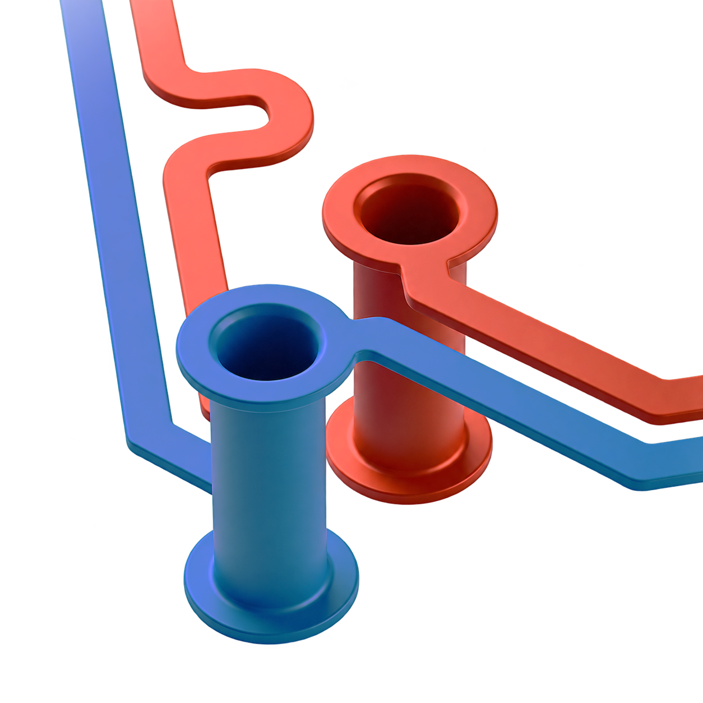

<p align="center"></p>

<p align="center">
  <a href="https://www.blender.org/download/"></a>
  <a href="https://www.kicad.org/download/"></a>
  <a href="LICENSE"></a>
</p>

# KiLeidoscope

An open-source project in early development, targeting KiCad 10 and Blender. GitHub is intended to remain private during initial development.

## Top-level project architecture

| Area | Intended responsibility |
| --- | --- |
| KiCad board import and updates | Bring a KiCad 10 board and subsequent edits into the project, with near-instant updates as the goal. |
| Blender visualization | Display the board and relevant analysis feedback in Blender. |
| Lightweight RF / signal-integrity analysis | Assess cross coupling, impedance mismatch and skew within and between pairs; explore S-parameters and basic EMI analysis where feasible. Focus on high-speed analog and digital rather than full FDTD or MoM. |
| Signal-profile library | Hold configurable requirements for common interface and route types, such as CSI, USB HS and USB SS: impedance, di/dt, maximum skew and other relevant constraints. |

## Decisions

| Topic | Decision |
| --- | --- |
| Import method | KiCad's official IPC API (`kicad-python` / `kipy`) for live board geometry, read-only. The one exception: a click in Blender selects that item in KiCad. No legacy `pcbnew` bindings. |
| Live updates | A bridge process polls KiCad every 200 ms. Edits appear about 0.1 s after the user finishes them. While an interactive tool runs KiCad answers "busy"; the bridge then reads committed routes from the board text instead, so routing shows without leaving the router. |
| Data sent to Blender | Whole (layer, kind) lists, such as all F.Cu tracks, re-sent when anything in them changes. No per-item deltas. |
| Blender display | Raw primitives (segment endpoints and widths, polygon rings, via points) turned into surfaces by Geometry Nodes. No meshing or triangulation code of our own. |
| Mask, silkscreen, models | `kicad-cli` exports (Gerbers, GLB) of a private copy of the open board, unsaved edits included, on a background worker. Results are cached by board content. |
| Analysis methods | Geometry-based only: closed-form impedance, spacing and parallel-length coupling, path-length skew, reference-plane checks. No field solver (MoM, FDTD, FEM). |
| Implementation language | Python 3.10+ for the bridge (Ubuntu 22.04 ships 3.10); a Python add-on inside Blender. |
| Component boundaries | Two processes: the bridge (KiCad access, board model, analysis) and the Blender add-on (display only), connected over local TCP. |
| Supported versions | KiCad 10, Blender 5.1. |

## Still open

- RF / signal-integrity analysis: not started.
- Signal-profile library: contents and format.
- S-parameters and EMI: how far geometry-based methods can go.

## Using KiLeidoscope

### Install

KiLeidoscope needs KiCad 10 and Blender 5.1 or newer. It installs as one KiCad package that holds the toolbar action, the bridge and the Blender add-on:

1. Build the package: `python tools/build_package.py` writes `dist/kileidoscope-<version>.zip`.
2. In KiCad, turn on Preferences > Plugins > **Enable KiCad API**.
3. Open the **Plugin and Content Manager**, choose **Install from File…** and pick the zip.
4. Restart KiCad. On its first start the plugin gets its own Python environment, and KiCad installs `kicad-python` and `numpy` into it (internet needed once). **Open in Blender** then appears on the PCB Editor toolbar.

On Ubuntu 22.04 or newer:

```
sudo add-apt-repository ppa:kicad/kicad-10.0-releases
sudo apt install kicad python3-venv
```

`python3-venv` lets KiCad create the plugin's environment; the system `python3` must be 3.10 or newer. For Blender, unpack the official `blender-5.1.x-linux-x64.tar.xz` in your home folder, `~/Applications` or `/opt`. Its `blender-5.1.x-linux-x64/blender` is found there, as is a Snap install or a `blender` on `PATH`. A Blender older than 5.1 is skipped.

If nothing opens, the reason is in `~/.cache/kileidoscope/blender.log` (Windows: `%LOCALAPPDATA%\KiLeidoscope\blender.log`), and a desktop notification names a missing or outdated Blender.

**Development install:** `python tools/install_kicad_plugin.py <plugins folder>/org.kileido.core` installs an action that runs this checkout in place, which must stay put. The plugins folder is `~/.local/share/kicad/10.0/plugins` on Linux and `Documents\KiCad\10.0\plugins` on Windows. Remove it before installing the package: both use the same identifier.

### Open from KiCad

**Open in Blender** starts Blender with a private bridge on a free loopback port; the bridge's token goes to Blender through its environment, never the command line. Closing that Blender window stops its bridge. Each click opens a separate viewer. Set `KILEIDO_BLENDER` to use a Blender other than the one found. On Windows only one KiCad instance at a time can serve plugins (KiCad issue #20880); the panel explains when another KiCad holds the connection.

### The viewer

The **KiLeidoscope** tab of the 3D View sidebar (**N**) holds everything:

- **Preview / Cycles**: EEVEE Material Preview or a path-traced Cycles viewport (on the GPU when there is one).
- **Colors**: the board's stackup colours as KiCad's 3D viewer shows them, **Realistic** (lit materials, metal where the solder mask is open, the board's copper finish), or the **PCB Editor** theme.
- **Light** and fill colour of the two studio softboxes above and below the boards.
- **Via fill** (capped vias), **X-ray mode** (everything but KiCad's selection turns faint grey), **Clip silkscreen to board outline**.
- **Boards**: the live board, view-only boards (see below), and the **Layers** list: KiCad's layers top to bottom through the board, an eye each, plus vias, components and drawing layers. **Thickness (3D)** sets copper (from the stackup), silkscreen (15 µm by default; KiCad stores none) and solder paste (stencil thickness).
- **Status**: the KiCad link, export progress and warnings.

A click on a track, via, pad or component selects it in KiCad (Shift+click adds to the selection); a click on bare board clears KiCad's selection. KiCad's selection shows in Blender: the selected net in red-orange, its differential-pair partner in blue, selected components boxed.

Solder mask, silkscreen, fabrication and user drawing layers and 3D component models follow unsaved edits a moment after they settle. Components without a model file show an envelope of KiCad's footprint bounds. Colours and layer heights are display approximations, not measured optical or physical properties.

### View-only boards

**Export…** saves the live board, as it looks now, to a `.blend` package. **Import…** adds such a package beside the others in any KiLeidoscope session, with or without KiCad. View-only boards can be moved, rotated and scaled (the select button next to the board chooser picks one), shown per layer, or all boards together. **Collision check** marks where boards overlap (components and board solids) with red boxes.

### Without the plugin

Dump the board open in KiCad and view it without a live link:

```
python -m kileido_bridge dump board.kls
blender --python blender_addon/start.py -- board.kls
```

In a running viewer, F3 **KiLeidoscope: Load dump** opens a `.kls` file. A `.json` output name writes a human-readable dump instead.

`python -m kileido_bridge bridge` serves the open board live on port 47811 and prints its token; start Blender with `KILEIDO_BRIDGE_PORT` and `KILEIDO_BRIDGE_TOKEN` set to those values and `--python blender_addon/start.py` to connect to it.

## Development

The bridge (`kileido_bridge/`) must not import `bpy`, and the add-on (`blender_addon/kileido/`) must not import the bridge or `kipy`; `tests/test_boundaries.py` enforces this and the read-only KiCad calls. The add-on keeps its own copy of the frame decoder (`client.py`), checked against the bridge's by `tests/test_addon_protocol.py`.

```
python -m pip install -e ".[test]"
python -m pytest -q
```

The Blender tests run headless against a synthetic KiCad board (`tests/fixtures/`):

```
blender --background --factory-startup --python tests/blender/run_all.py
blender --background --factory-startup --python tests/blender/run_live.py
blender --background --factory-startup --python tests/blender/run_boards.py
blender --background --factory-startup --python tests/blender/run_collisions.py
blender --background --factory-startup --python tests/blender/run_outline.py
blender --background --factory-startup --python tests/blender/run_silk.py
blender --background --factory-startup --python tests/blender/run_exports.py
```

## Disclaimer

KiLeidoscope is a visualization and inspection aid. It is not a design-rule checker, signal-integrity sign-off, or manufacturing tool, and it does not replace KiCad's DRC, your fabricator's checks, or proper simulation and measurement.

What KiLeidoscope shows can differ from the real board: geometry is simplified, colors and layer heights are display approximations, and analysis results use closed-form estimates. Always verify your design in KiCad and with your manufacturer before ordering.

You use KiLeidoscope at your own risk. The authors are not responsible for faulty, failed or non-working boards, manufacturing costs, lost time, damage to equipment, or any other loss resulting from its use. See sections 15 and 16 of the [license](LICENSE) for the full warranty disclaimer and limitation of liability.

KiLeidoscope is an independent project. It is not affiliated with, endorsed by, or sponsored by the KiCad project or the Blender Foundation. KiCad and Blender are trademarks of their respective owners.

## License

Copyright © 2026 nvrooijen

KiLeidoscope is free software, licensed under the [GNU General Public License v3.0 or later](LICENSE), the same family of license as KiCad and Blender. It is distributed WITHOUT ANY WARRANTY; without even the implied warranty of MERCHANTABILITY or FITNESS FOR A PARTICULAR PURPOSE.

If KiLeidoscope is useful to you, a mention or a link back to this project when you share renders or build on it is appreciated, but never required.

### Name and logo

The GPL covers the code, not the KiLeidoscope name or logo. The name and logo are © 2026 nvrooijen, all rights reserved. You are free to fork and modify the code under the GPL, but please give your fork a different name and logo, and do not present it as the official KiLeidoscope project. Referring to KiLeidoscope by name, for example to say that your project is based on it, is fine.
