<p align="center">
  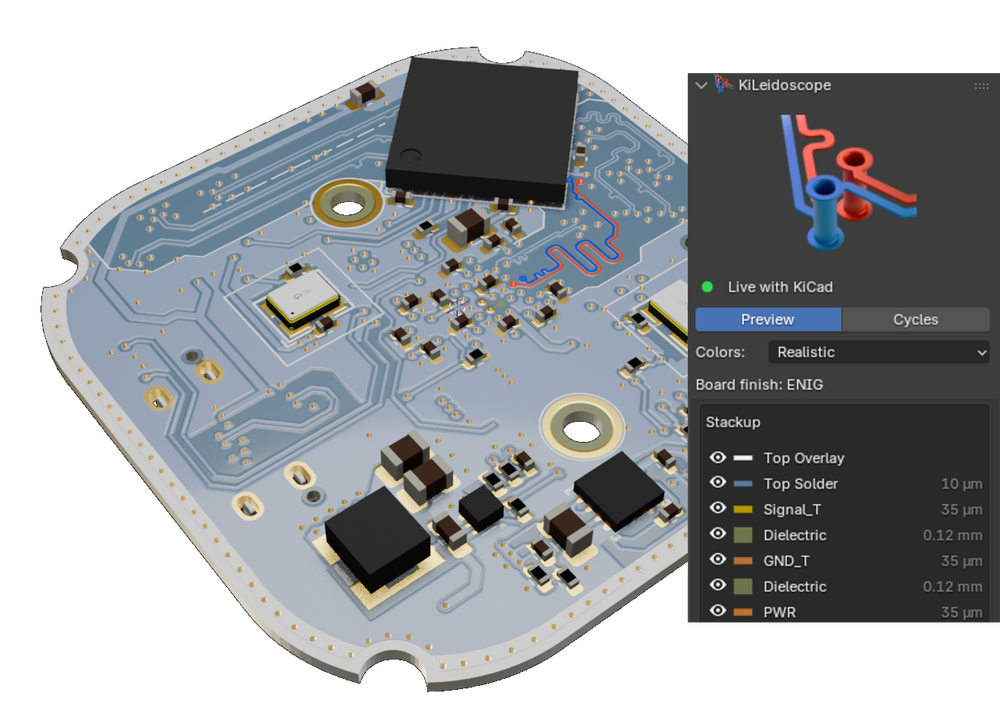
  &nbsp;&nbsp;
  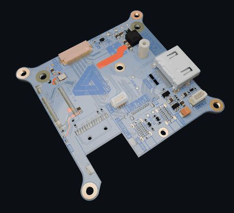
</p>
<p align="center"><sub>Right: real-time edits in KiCad appear in the Cycles render as the board turns, showcasing the various different modes of visualization and editing.<br>
Board: <a href="https://github.com/piecol/CM5_MINIMA_REV3">CM5 MINIMA REV3</a> by Pierluigi Colangeli (CERN-OHL-S v2); the edits were made for this demo and are not part of the design.</sub></p>

<p align="center">
  <a href="https://www.blender.org/download/"></a>
  <a href="https://www.kicad.org/download/"></a>
  <a href="LICENSE"></a>
</p>

# KiLeidoscope

KiLeidoscope is an interactive, real-time bridge between KiCad and Blender 3D software. Using KiCad's official IPC API, edits of your board open in KiCad appear in Blender a fraction of a second after you make them. Furthermore, the bridge works bi-directional, as selections in Blender are visible in the KiCad software as well. The interactive UI has several advantages over the existing KiCad 3D UI; Not only does it provide the PCB designer with a more aesthetically pleasing environment, it also allows for various interactive modes, such as 'X-Ray vision', trace and differential pair highlighting and multi-board assemblies. 

KiLeidoscope is fully open source and in early development; feedback and contributions are welcome (see [CONTRIBUTING.md](CONTRIBUTING.md)).


<p align="center">
  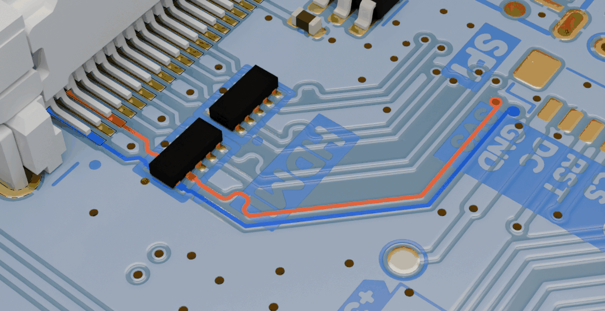
  &nbsp;&nbsp;
  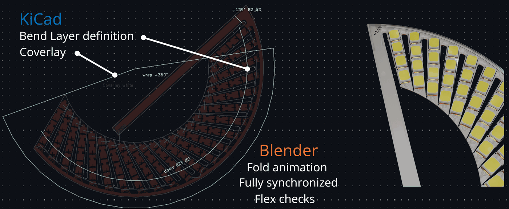
</p>
<p align="center"><sub>Left: a differential pair selected in KiCad, with and without X-ray mode.
Board: <a href="https://github.com/piecol/CM5_MINIMA_REV3">CM5 MINIMA REV3</a> by Pierluigi Colangeli (CERN-OHL-S v2).<br>
Right: flex mode (beta): a flex LED ring, flat in KiCad with its marks on the Bend layer, folding in Blender. See the <a href="docs/flex.md">flex guide</a>.</sub></p>

## Features

- Live 3D view of the open board: copper, zones, pads, vias, drills and the board outline, updated as you edit.
- Solder mask, silkscreen, fabrication and drawing layers and 3D component models, from KiCad's own exports of the unsaved board.
- Selection both ways: a click in Blender selects in KiCad, and KiCad's selection shows in Blender, with the differential-pair partner in blue.
- Blender's EEVEE preview or Cycles engine, using different colour modes for either KiCad's PCB editor theme or realistic representations.
- Per-layer visibility, X-ray mode and adjustable layer thickness.
- View-only boards: save a board as a `.blend` package, place several side by side and check them for collisions. In a future update, Linux users will be able to control multiple boards simultaneously in the same Blender UI, allowing for true multi-PCB assemblies. 
- IMS boards: a 2-layer board drawn on its aluminum or copper base, the thin epoxy under F.Cu, in 3D and in the cross section, with warnings for vias and plated holes that would short to the base. See the [IMS guide](docs/ims.md).
- Flex and rigid-flex boards (beta): bends, twists, cones, wraps and domes folded in Blender from marks on KiCad's Bend and Stiffener layers, with the stiffeners, the coverlay and flex checks as you route. Two KiCad templates to start from. See the [flex guide](docs/flex.md).
- KiCad DRC on the 3D board: run KiCad's own design rule check from the sidebar and click a finding to see it drawn where it is: the items lit, the gap measured against its limit, a hole problem cut open in section, and a marker per finding on the board. See the [DRC guide](docs/drc.md).

<p align="center">
  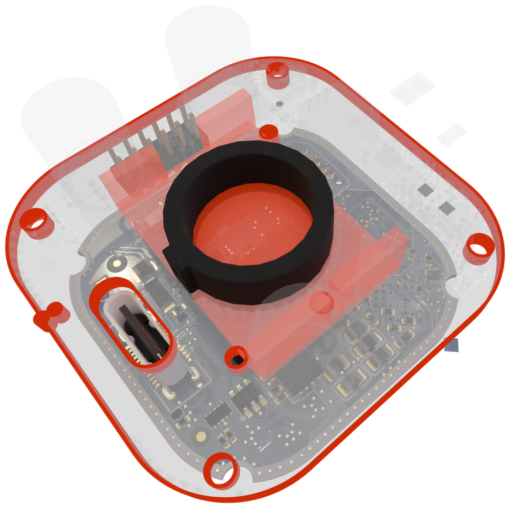
  &nbsp;&nbsp;
  <picture>
    <source media="(prefers-color-scheme: dark)" srcset="assets/CutPlaneViasAnnotatedDark_web.png">
    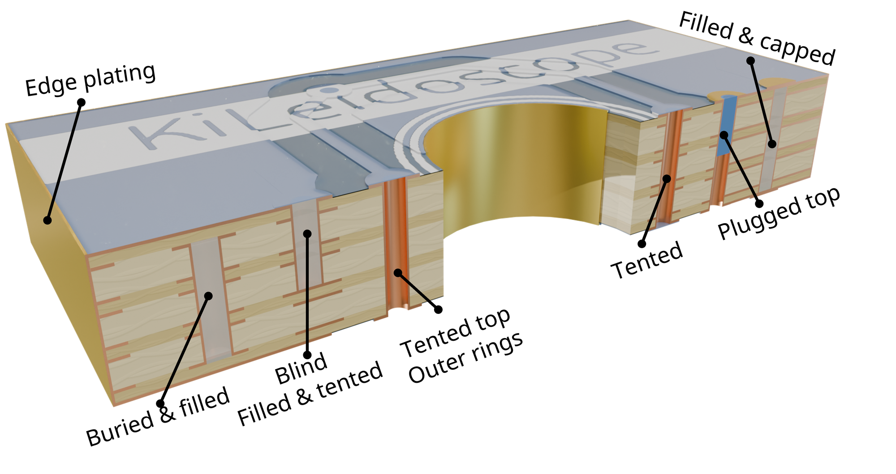
  </picture>
</p>
<p align="center"><sub>Left: Multi-board assembly mode, visualizing board and component collisions. Malformed board outlines are highlighted.<br>
Right: the cut plane opens the board and shows its cross section, with each via drawn as KiCad has it set. See the <a href="docs/cut-plane.md">cut plane guide</a>.</sub></p>

<p align="center">
  <picture>
    <source media="(prefers-color-scheme: dark)" srcset="assets/IMS_dark_web.png">
    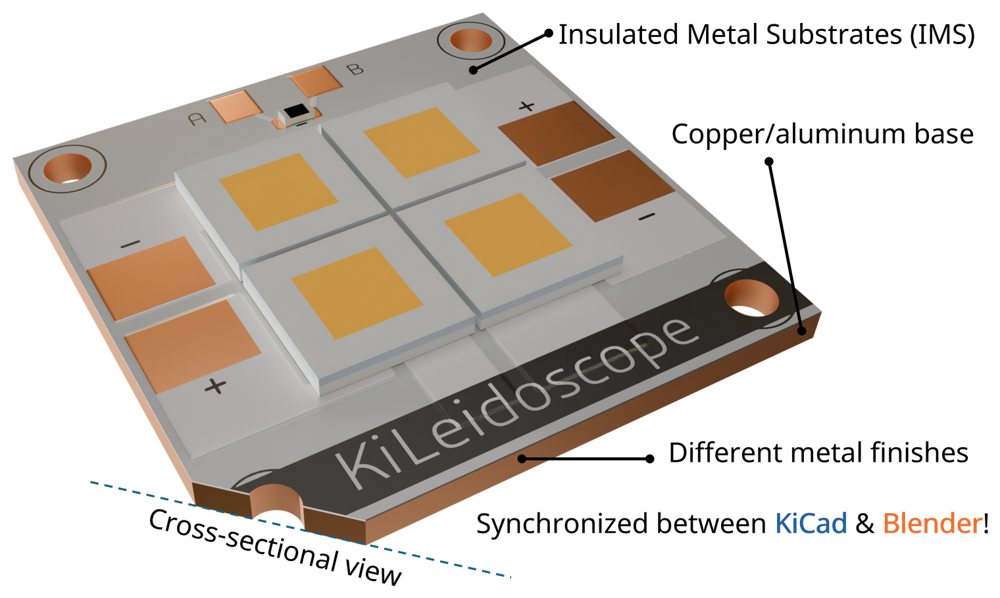
  </picture>
  &nbsp;&nbsp;
  <picture>
    <source media="(prefers-color-scheme: dark)" srcset="assets/FlexAnnotated_dark_web.png">
    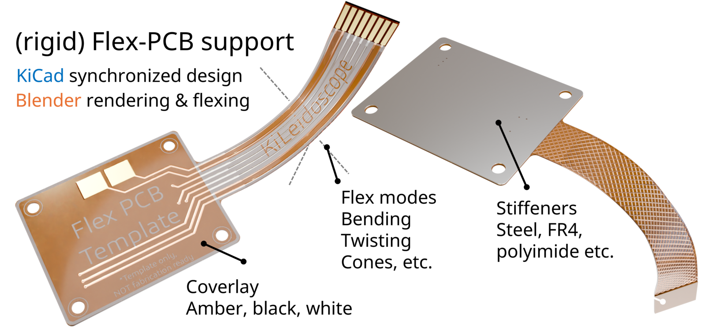
  </picture>
</p>
<p align="center"><sub>Left: IMS mode: an LED board on a copper base in Realistic mode. In KiCad it is a plain 2-layer board; KiLeidoscope draws its metal base. See the <a href="docs/ims.md">IMS guide</a>.<br>
Right: flex mode (beta): the flex template folded in Blender from a few marks on its Bend and Stiffener layers in KiCad, with its coverlay and stiffeners. See the <a href="docs/flex.md">flex guide</a>.</sub></p>

## Architecture

<picture>
  <source media="(prefers-color-scheme: dark)" srcset="assets/architecture-dark.svg">
  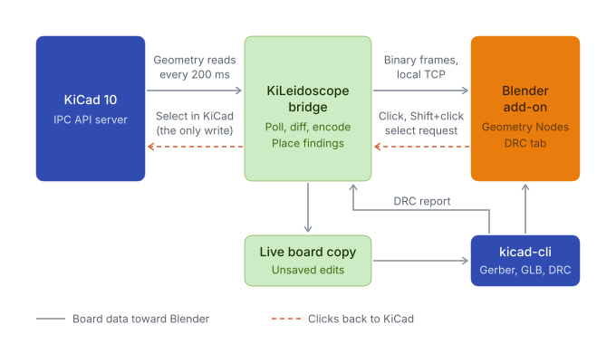
</picture>

KiLeidoscope consists of two processes. The **bridge** polls the board from KiCad through the official IPC API (`kicad-python`) every 200 ms. A list containing the changes is then forwarded to Blender as binary frames over a local TCP connection. The **Blender add-on** is mostly read-only: Geometry Nodes turn raw segments, polygons and via points into surfaces. The only Blender-to-KiCad part: a click in Blender becomes a selection in KiCad.

Mask, silkscreen and 3D models take a second path. The bridge keeps a copy of the open board, unsaved edits included, and the add-on has `kicad-cli` export Gerbers and GLB models from it on a background worker. Results are cached by board content.

| Topic | Choice |
| --- | --- |
| KiCad access | Official IPC API, read-only apart from selection. No legacy `pcbnew` bindings. |
| Data sent to Blender | Whole (layer, kind) lists, such as all F.Cu tracks, re-sent when anything in them changes. No per-item deltas. |
| Language | Python 3.10+ for the bridge (Ubuntu 22.04 ships 3.10); a Python add-on inside Blender, with one small C library for drawing the Gerber overlays (numpy fallback when it is not built for the platform). |
| Boundaries | The bridge never imports `bpy`; the add-on never imports the bridge or `kipy`. `tests/test_boundaries.py` enforces this. |


## Real-time updates

<picture>
  <source media="(prefers-color-scheme: dark)" srcset="assets/latency-dark.svg">
  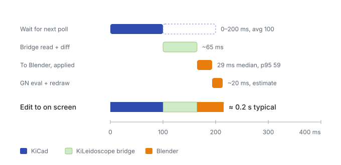
</picture>

A finished track edit reaches the Blender viewport in about 0.2 s. Most of that is waiting for the next 200 ms poll; the bridge then reads and compares the board in about 65 ms, and Blender applies the change in under 30 ms (median). The stage times were measured on a board with about 2,100 tracks, 450 vias and 125 footprints (Ryzen 7 7700). The total is added up from those stages, and the redraw time is an estimate.

- **While a tool is running** (move, drag, route), KiCad answers every API call with "busy". The bridge then reads the committed routes from the board text every 0.5 s, so routing shows without leaving the router.
- **Mask, silkscreen and models** follow about 1.5–2 s after edits settle, the time `kicad-cli` needs to export them.
- **Selection** highlights in Blender at once. KiCad applies it when it next responds, which can take a few seconds while its window is behind Blender.

<p align="center">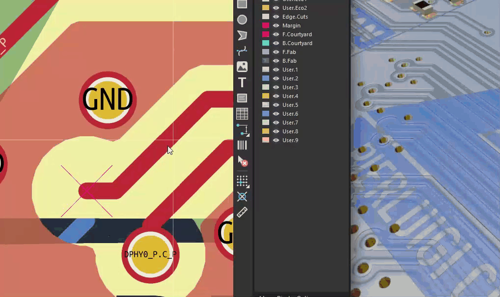</p>

## Installation

KiLeidoscope needs KiCad 10 and Blender 5.1 or newer (tested with 5.1 and 5.2). It installs as one KiCad package that holds the toolbar action, the bridge and the Blender add-on:

1. Download `kileidoscope-<version>.zip` from [Releases](https://github.com/nvrooijen/KiLeidoscope/releases), or build it yourself: `python3 tools/build_native.py` (the C overlay library for your platform, optional but about 8× faster) and then `python3 tools/build_package.py` (`python` on Windows), which writes `dist/kileidoscope-<version>.zip`.
2. In KiCad, under Preferences > Plugins, turn on **Enable KiCad API** and set **Python interpreter** to KiCad 10's own: `C:\Program Files\KiCad\10.0\bin\pythonw.exe` on Windows, the system `/usr/bin/python3` on Linux.
3. Open the **Plugin and Content Manager**, choose **Install from File…** and pick the zip.
4. Restart KiCad. On its first start the plugin gets its own Python environment, and KiCad installs `kicad-python` and `numpy` into it (internet needed once). **Open in Blender** then appears on the PCB Editor toolbar.

### Linux

On Ubuntu 22.04 or newer:

```
sudo add-apt-repository ppa:kicad/kicad-10.0-releases
sudo apt install kicad python3-venv
```

`python3-venv` lets KiCad create the plugin's environment; the system `python3` must be 3.10 or newer. Set it as KiCad's **Python interpreter** (`/usr/bin/python3`, step 2 above). KiCad builds that environment from the Python it finds on its first start, so start KiCad the first time from the app menu or a shell without an active conda or other Python environment. For Blender, unpack the official `blender-5.1.x-linux-x64.tar.xz` in your home folder, `~/Applications` or `/opt`. Its `blender-5.1.x-linux-x64/blender` is found there, as is a Snap install or a `blender` on `PATH`. A Blender older than 5.1 is skipped.


### macOS
Untested, looking for contributors as I have no macOS available.

## Usage

### Open from KiCad

**Open in Blender** starts Blender with a private bridge on a free loopback port; the bridge's token goes to Blender through its environment, never the command line. Closing that Blender window stops its bridge. Each KiCad has one viewer: while it is open, another click only shows a notification. Set `KILEIDO_BLENDER` to use a Blender other than the one found. On Windows only one KiCad instance at a time can serve plugins (KiCad issue #20880); the panel explains when another KiCad holds the connection.

### The viewer

The **KiLeidoscope** tab of the 3D View sidebar (**N**) holds everything:

- **Preview / Cycles**: EEVEE Material Preview or a Cycles viewport (on the GPU when there is one).
- **Colors**: the board's stackup colours as KiCad's 3D viewer shows them, **Realistic** (lit materials, metal where the solder mask is open, the board's copper finish), or the **PCB Editor** theme.
- **Light** and fill colour of the two studio softboxes above and below the boards.
- **Via fill** (capped vias), **X-ray mode** (everything but KiCad's selection turns faint grey), **Clip silkscreen to board outline**.
- **Boards**: the live board, view-only boards (see below), and the **Layers** list: KiCad's layers top to bottom through the board, an eye each, plus vias, components and drawing layers. **Thickness (3D)** sets copper (from the stackup), silkscreen (15 µm by default; KiCad stores none) and solder paste (stencil thickness).
- **Status**: the KiCad link, export progress and warnings.

A click on a track, via, pad or component selects it in KiCad (Shift+click adds to the selection); a click on bare board clears KiCad's selection. KiCad's selection shows in Blender: the selected net in red-orange, its differential-pair partner in blue, selected components boxed. Double tapping 'a' will deselect everything as standard in Blender. 

Components without a model file show an envelope of KiCad's footprint bounds, this can be turned off. Colours and layer heights are display approximations, not measured optical or physical properties.

### View-only boards

**Export…** saves the live board, as it looks now, to a `.blend` package. **Import…** adds such a package beside the others in any KiLeidoscope session, with or without KiCad. Imported boards join the live one in a list: click a board for its layers below (or **All boards**), and the select arrow in front of a view-only board picks it to move, rotate or scale. **Collision check** marks where boards overlap (components and board solids) with red boxes. Future version will enable multi-board editing on KiCad for linux. 

## Known limitations

- **KiCad API**: KiLeidoscope only works with **Enable KiCad API** turned on (Preferences > Plugins).
- **One KiCad on Windows**: only one KiCad instance at a time can serve plugins ([KiCad issue #20880](https://gitlab.com/kicad/code/kicad/-/issues/20880)).
- **macOS**: untested.
- **Overlays on other platforms**: the release zip carries the fast overlay library for Windows and Linux on x86-64. Elsewhere (macOS, ARM) the add-on draws mask and silkscreen with its numpy fallback (same images, slower) unless you build the library with `python3 tools/build_native.py`.
- **Multi-board editing**: only the live board follows KiCad; other boards are view-only packages.

## Roadmap
Future work includes the construction of an adapter for various animations, such as E/H field propagations, surface currents, and thermal stresses. 

## Disclaimer

KiLeidoscope is a visualization and inspection aid. It is not a design-rule checker, signal-integrity sign-off, or manufacturing tool, and it does not replace KiCad's DRC, your fabricator's checks, or proper simulation and measurement. The DRC column shows KiCad's own DRC results and adds no checks of its own; run the final check in KiCad before you order (see the [DRC guide](docs/drc.md#disclaimer)).

What KiLeidoscope shows can differ from the real board: geometry is simplified, colors and layer heights are display approximations, and analysis results use closed-form estimates. Always verify your design in KiCad and with your manufacturer before ordering.

You use KiLeidoscope at your own risk. The authors are not responsible for faulty, failed or non-working boards, manufacturing costs, lost time, damage to equipment, or any other loss resulting from its use. See sections 15 and 16 of the [license](LICENSE) for the full warranty disclaimer and limitation of liability.

KiLeidoscope is an independent project. It is not affiliated with, endorsed by, or sponsored by the KiCad project or the Blender Foundation. KiCad and Blender are trademarks of their respective owners.

## License

Copyright © 2026 Nick van Rooijen

KiLeidoscope is free software, licensed under the [GNU General Public License v3.0 or later](LICENSE), the same family of license as KiCad and Blender. It is distributed WITHOUT ANY WARRANTY; without even the implied warranty of MERCHANTABILITY or FITNESS FOR A PARTICULAR PURPOSE.

If KiLeidoscope is useful to you, a mention or a link back to this project when you share renders or build on it is appreciated!

### Name and logo

The GPL covers the code, not the KiLeidoscope name or logo. The name and logo are © 2026 Nick van Rooijen, all rights reserved. 

## About the Author

KiLeidoscope is made by **Nick van Rooijen**, who has a PhD in Electrical Engineering.
Questions and bug reports: [GitHub Issues](https://github.com/nvrooijen/KiLeidoscope/issues).
Say hi on LinkedIn https://www.linkedin.com/in/nick-van-rooijen-23a28114b/).
