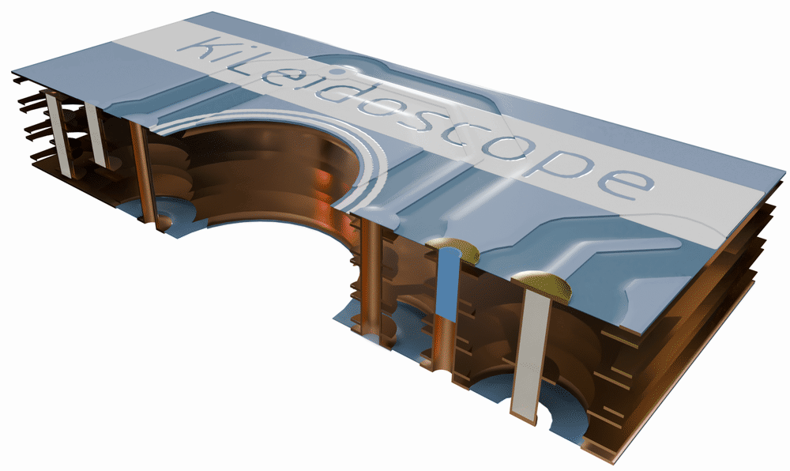
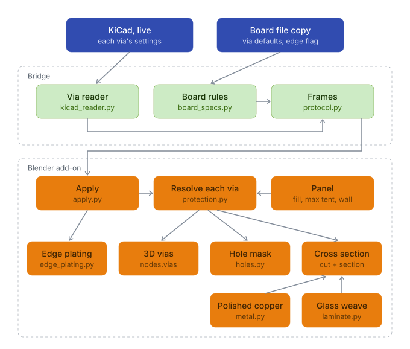

# (New!) Cutting planes and via cross-sections

As new and requested feature, board inspections can now be done on a cross-sectional level. This can be particularly useful when dealing with complex stack-ups. Simply by selecting the cut plane feature, a movable upright plane appears upon which the cross-section sit: the laminate of the stack-up, every copper layer at its stack-up thickness, vias with their plating, plugs, fills, caps and tents and a plated board edge. The tool relies on KiCad's built-in board stack-up and via settings, and the bridge synchronizes your changes directly to Blender. Edit a via's protection, move a track or change the stackup, and the section redraws a moment later.

<picture>
  <source media="(prefers-color-scheme: dark)" srcset="../../assets/CutPlaneViasAnnotatedDark_web.png">
  
</picture>

A test board cut open in Realistic mode. Each via's type is set in KiCad; KiLeidoscope draws what KiCad stores.

## Contents

- [Using the cut plane](#using-the-cut-plane)
- [What the section shows](#what-the-section-shows)
- [Via protection](#via-protection)
- [Plated board edge](#plated-board-edge)
- [How it works](#how-it-works)
- [Where each value comes from](#where-each-value-comes-from)
- [Known limitations](#known-limitations)
- [Disclaimer](#disclaimer)

## Using the cut plane

All controls are in the **KiLeidoscope** tab of the 3D View sidebar (**N**).

1. Tick **Cut plane**. A wireframe sheet named `KLS cut plane` appears across the middle of the board. Its arrow points to the side that is removed.
2. Press **X** or **Y** to turn the plane across that axis; it keeps its position. **Reset** puts it back across the middle. **Flip** removes the other side instead.
3. Move the plane to cut somewhere else. Select `KLS cut plane` in Blender's Outliner, or drag a box over its wireframe. Then press **G** to move it, or **R** and **Z** to turn it about the vertical axis. Any angle about Z works, so diagonal cuts are fine. These are the typical blender hotkeys. 

The section is drawn only while the plane stands upright. A tilted plane still hides one side of the board, and the panel then says *Turn the plane upright for a cross section*.

| Control | What it does |
| --- | --- |
| **Cut plane** | Cuts the board open and draws the section. Off: the board is whole again. |
| **X** / **Y** / **Reset** | Turn the plane across X or Y, or put it back across the middle of the board. |
| **Flip** | Remove the other side of the plane. |
| **Via fill** | Resin or copper: the material of the vias KiCad marks filled or capped. KiCad does not store it. |
| **Max tent hole** | The largest finished hole (mm) a solder mask tent is drawn across. Default 0.30 mm. |
| **Via wall (µm)** | Plating thickness of via barrels and plated pad holes, in 3D and in the section. Default 25 µm. |

The cut works together with the other view modes:

- **X-ray mode** fades the section along with the rest of the board.
- **Colors: Realistic** lights the cut copper as polished metal. It also shows the stack-up bands and the glass weave on the board's routed edges, with or without the cut. The other colour modes draw the section flat.
- **Layers**: the section draws the copper layers and vias that are shown.

<picture>
  <source media="(prefers-color-scheme: dark)" srcset="../../assets/CutPlaneVias_XrayWipe_dark.gif">
  
</picture>

The demo board with the laminate hidden, wiping into X-ray mode.

## What the section shows

- **Laminate**: one band per dielectric of the stack-up, at its thickness. Cores are pale and prepregs a little darker, each with a woven-glass texture. Dielectrics whose material name contains *polyimide*, *PTFE* or *Rogers* get their own colour.
- **Copper**: tracks, pads, zones and graphics of every copper layer, at the layer's stack-up thickness. Cut copper is always shown bare, since a cut never carries the board finish.
- **Vias**: the drill, the plated wall, the lands, and annular rings on the layers that KiCad's **Annular rings** setting of the via gives one. Blind vias end on a flat land on their inner layer.
- **Plugs, fills, caps and tents**: see [Via protection](#via-protection).
- **Pad holes**: round and oblong, plated or not, through the whole board.
- **Plated board edge**: a copper strip on the board's wall. See [Plated board edge](#plated-board-edge).

## Via protection

KiCad 10 stores protection features per via (select a via, **E**, *Protection features*), following IPC-4761. A via without its own setting follows the board's defaults from Board Setup. KiLeidoscope reads both and draws each via accordingly, in 3D and in the section. There are no overrides on the Blender side. The global board settings can be found in KiCad through 'Edit' -> 'Edit Track & Via properties' -> 'Via protection features'. For individual via protection, selecting a single via's properties with **E**, allows you to edit these features on an individual basis. 

| In KiCad | Drawn as |
| --- | --- |
| Nothing set | An open hole you can see through. Its lands read as rings and its barrel gets the board finish. |
| **Tented** or **covered** (per side) | A thin disk of solder mask closing the hole on that side. The barrel stays bare copper. |
| **Plugged** (per side) | Solder mask ink, in the mask's colour, filling half the barrel from that side. Plugged from every outer end, the ink fills the whole barrel. |
| **Filled** | The whole barrel filled with the panel's **Via fill** material: milky resin or copper. |
| **Capped** | Filled, and plated over at each outer end with a 20 µm cap, so the land is a closed copper disk. |
| Blind via | A hole on one side only, ending on a flat land on its inner layer. |
| Buried via | Always filled with resin, as the prepreg fills it when the board is pressed. KiCad's filled flag picks the **Via fill** material instead. |

No tent spans a large empty hole. Where KiCad tents or covers a via whose finished hole is larger than **Max tent hole**, and nothing plugs or fills it, the via is shown open on that side. The panel then counts these vias: *N vias too large to tent: shown open*. The finished hole is the drill less twice the **Via wall**. Do note that this feature is fabricator-dependent, and is just for illustrative purposes.  

## Plated board edge

With **Plated board edge** ticked in KiCad (Board Setup, Board Finish), KiLeidoscope plates the stretches of the board outline that copper on both F.Cu and B.Cu reaches. Cutouts and slots count as edges too. The plating is a 25 µm skin over the whole height of the board, in the board's finish, and it wraps sharp outside corners.

Copper counts as reaching the edge when it comes within 50 µm of it. KiCad rounds the corners of zone fills, so a fill that stops within 0.2 mm of a sharp corner of the outline is taken to reach that corner.

## How it works

<picture>
  <source media="(prefers-color-scheme: dark)" srcset="../../assets/via-structure-dark.svg">
  
</picture>

The bridge reads each via's protection and annular rings from KiCad's API. The board's via defaults, the plated-edge flag and the core and prepreg types are not in the API, so they come from the bridge's live copy of the board file. The add-on resolves every via against those defaults and the three panel settings, then draws the result four ways: the 3D vias, the hole mask that makes open holes see-through, the edge plating and the cross-section.

Nothing is cut with booleans (too slow!). The removed side is hidden by one shared shader stage in every material, and the section is a flat mesh of coloured rectangles drawn on the plane. Moving the plane only recomputes where the cut crosses the board, so it stays interactive.

## Where each value comes from

KiCad does not store everything a cross-section needs. This table shows what is real board data and what is an assumption.

| Shown | Source |
| --- | --- |
| Layer order, copper and dielectric thickness | KiCad's stack-up. Copper without a thickness is drawn 35 µm thick. |
| Core or prepreg, dielectric material | The board file's stack-up. |
| Via position, drill, land, start and end layer | KiCad, per via. |
| Via protection, annular rings | KiCad, per via. The board's defaults apply to vias set to follow the design rules. |
| Plated board edge on or off | The board file (Board Setup, Board Finish). |
| Barrel plating thickness | The panel's **Via wall**, one value for every via and plated pad hole. |
| Fill material | The panel's **Via fill**, one choice for the whole board. |
| Largest tented hole | The panel's **Max tent hole**. |
| Cap plating, edge plating thickness | Fixed: 20 µm and 25 µm. |
| Solder mask thickness over a tent | KiCad's stack-up, else 10 µm. |
| Glass weave | Illustration: a heavy cloth in cores and a lighter one in prepregs |
| Colours | Display approximations of a polished micrograph. |

Settings that only the board file holds are read from the bridge's live copy of the board, so they follow Board Setup edits without saving.

## Known limitations

**The cut**

- The section needs an upright plane. A tilted plane only hides one side.
- There is one cut plane, and it is straight. Stepped or multiple cuts are not (yet) supported.
- Only the live board is cut. View-only boards are not, and an exported `.blend` package does not carry the cut or its section.
- Nothing is actually cut. The materials make the removed side transparent, so its geometry is still there for Blender's own tools, exports and measurements.
- Components are opened but not closed again: a cut 3D model shows as a hollow shell.

**What the section leaves out**

- Solder mask (apart from tents), silkscreen, solder paste and the surface finish are not drawn in the section.
- Backdrills, counterbores and countersinks are not drawn. Microvias are drawn like any other blind via, with straight walls.

**Simplified geometry**

- Every shape in the section is a rectangle. Traces have no etch taper, drilled walls are straight, and resin does not flow or recess.
- Outer copper is drawn at its stack-up thickness. The plating that a real board gains on its outer layers is not added.
- Inner copper is drawn embedded in the laminate below it. Which dielectric really fills between the traces depends on the build.
- A plug from one side is drawn to exactly half the barrel's depth. Real plug depth varies.
- For annular rings on connected layers only, the connection is judged from the geometry: copper reaching the via's land. KiCad's own connectivity is not queried.

**Assumed values**

- KiCad stores no plating thickness. Barrel, cap and edge plating use the values in the table above, the same for every via and hole.
- KiCad stores no fill material. One choice applies to every filled and capped via.
- **Max tent hole** is a display rule, not your fabricator's capability. Covered vias are drawn like tented ones.
- The glass weave is an illustration. It does not show the real glass style, ply count or resin content of your laminate.
- Core and prepreg colours are generic. Only polyimide, PTFE and Rogers materials are told apart, by name.

**Edge plating**

- KiCad's setting is one flag for the whole board. KiLeidoscope decides where the plating goes: only where copper on both outer layers reaches the edge. Inner layers are not considered, and your fabricator may plate differently.

**Versions**

- Via protection needs KiCad 10. It was developed and tested against KiCad 10.0.3, where `kicad-python` does not yet wrap all of these settings, and they are read from the API's raw fields. Other versions may behave differently.

## Disclaimer

The cross-section is an illustration built from your design data and the assumptions listed above. It is not a micrograph, a fabrication drawing or a prediction of how your board will be built. I hope the tool can mainly serve as both educational and for visualization work. 

- **Do not take measurements from it.** Plating, cap, tent and plug dimensions are assumed values, and the geometry is simplified.
- **It is not a manufacturability check.** A via drawn as tented, plugged, filled or capped only reflects what is set in KiCad. Whether your fabricator can and will build it that way is for you and them to confirm. The same holds for edge plating and for the *too large to tent* warning.
- **It does not replace KiCad's DRC or your fabricator's review.** Give your fabricator explicit notes for via protection, via fill and edge plating. Do not rely on a render to convey them.
- **It says nothing about electrical, thermal or mechanical behaviour.** Impedance, current capacity and the reliability of filled or capped vias need proper analysis and measurement.

The [disclaimer](../../README.md#disclaimer) and [license](../../LICENSE) of KiLeidoscope apply in full: the software comes without any warranty, and you use it at your own risk.
