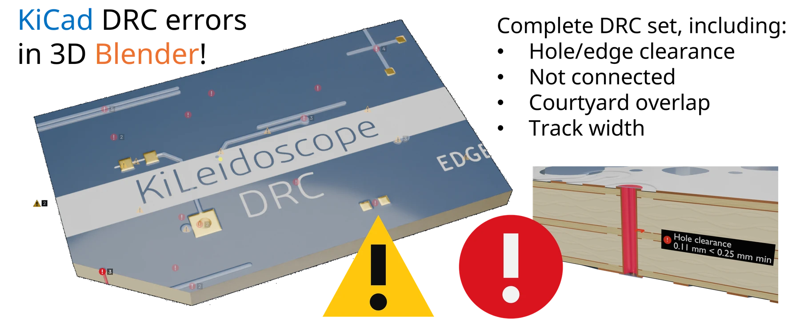

<!-- Preliminary guide for 0.5.0: text to be reviewed, pictures still to come. -->

# (New!) KiCad DRC on the 3D board

The Kileidoscope bridge is now updated with KiCad's DRC, which can be run directly from the UI. KiCad's design rule checker tells you what is wrong and where. It is, however, limited to 2D, whereas PCBs are inherently 3D objects. Some problems read much better in 3D: a via whose drill comes too close to a pad on an inner layer, a track squeezed past a board edge on the bottom side, two holes that nearly touch through every layer. KiLeidoscope's DRC column runs KiCad's own DRC on the board as it is open in KiCad, lists what it finds, and draws the finding you pick on the 3D board: the items involved lit, the gap measured, the label beside it, and a hole problem cut open so you see the barrels in section.

KiLeidoscope does not check anything itself. Every finding is KiCad's; KiLeidoscope only shows it, and measures the gap again on the board so the drawing sits where the problem is.

<picture>
  <source media="(prefers-color-scheme: dark)" srcset="../assets/InfographDRC_Dark_gh3.webp">
  
</picture>

## Contents

- [Before you start](#before-you-start)
- [Running DRC](#running-drc)
- [The list](#the-list)
- [Showing a finding](#showing-a-finding)
- [What is drawn](#what-is-drawn)
- [Markers on the board](#markers-on-the-board)
- [Confirm and dismiss](#confirm-and-dismiss)
- [The .kileidoscope folder](#the-kileidoscope-folder)
- [Findings files from a script](#findings-files-from-a-script)
- [How it works](#how-it-works)
- [Known limitations](#known-limitations)
- [Disclaimer](#disclaimer)

## Before you start

- **A live link.** Open the board in Blender with **Open in Blender** in KiCad's PCB editor. Without a live link the **DRC** tab is greyed out and the button is off; a list from earlier stays readable.
- **A saved board.** DRC runs and their results are kept in a folder beside the board file, so an unsaved new board has nowhere to put them. Save it once; unsaved edits after that are fine (see below).
- **kicad-cli.** It comes with KiCad. KiLeidoscope uses the one of the KiCad you are running, else `KILEIDO_KICAD_CLI` if set, else the first on your `PATH`, else the newest installed KiCad. A KiCad 9 kicad-cli cannot read a KiCad 10 board.

## Running DRC

The DRC column lives beside the **KiLeidoscope** tab of the 3D View sidebar (**N**): a click on the red **DRC** bookmark tab opens it, a second click closes it. A lit stripe on the tab shows that a finding is drawn.

Press **KiCad DRC**. The button reads *Running KiCad DRC…* until KiCad's report is in; on a large board that takes a few seconds.

What is checked:

- **The board as it is in KiCad now**, unsaved edits included. KiLeidoscope takes KiCad's own copy of the open board, not the file on disk.
- **Your rules.** The project file and the custom rules file (`.kicad_pro`, `.kicad_dru`) go with it: net classes, constraints, rule severities and your exclusions all apply, as in KiCad's own DRC dialog.
- **Errors and warnings.** Entries you excluded in KiCad stay out. Library notices (a footprint that differs from its library) are left out and counted under the list's header.
- **The zone fills you see.** Zones are not refilled first; refill in KiCad (**B**) if you want DRC to check fresh fills.
- **Not the schematic.** Schematic parity is not checked here; use KiCad's own DRC dialog for that.

If DRC fails, the column says why (*DRC failed: …*), and the last run's list stays.

> **Before you order a board,** run the final DRC in KiCad's own **Design Rules Checker** dialog, not here: see the [disclaimer](#disclaimer).

## The list

The header reads, for example, *KiCad DRC 10.0.6, run 3: 34 findings, 2 dismissed*. Below it the findings are grouped by check (`drc.clearance`, `drc.hole_clearance`, …), groups with errors first. A group of one is a single row; larger groups open and close with their arrow. When a list has more than 20 findings its groups start closed.

KiCad reports some problems many times over: once per track segment, per layer, per zone island. KiLeidoscope keeps one finding per check and pair of items and says how often KiCad reported it, *(reported 3 times)*.

Each row has:

| | What it does |
| --- | --- |
| Severity icon | A red circle "!" for an error, a yellow triangle "!" for a warning, a blue circle "i" for info, a tick once confirmed, and a grey "?" when KiLeidoscope cannot back the finding up (see below). |
| **Title** | Shows the finding on the board; a second click hides it. |
| Select arrow | Selects the finding's items in KiCad, and centres KiCad on them when **Center KiCad on click** is on. |
| Tick | Confirms the finding. |
| Cross | Dismisses it. |

**Board changed since this check: run it again to be sure** appears once you edit the board after a run. The list stays and is still drawn on the board as it is now, but it may no longer be complete or current.

### The grey "?"

A finding gets the grey "?" instead of its severity icon when KiLeidoscope cannot back it up on the board as it is now:

- **Its items are gone.** You deleted or rerouted them since the run. The row is greyed and its details say *Its items are no longer on the board*.
- **A target was not found**, or a drawing could not be made; the details say which and why.
- **The measurement does not support it.** KiLeidoscope measures every clearance, edge gap and width again on the live board. When all of them now meet their limits, the details say *Measured within the limit: the measurement does not support this finding*. Usually the board was fixed after the run; run DRC again.

## Showing a finding

A click on a finding's title:

1. draws it on the board (below),
2. frames the 3D views on it and its labels, from the side it is on: a problem on the bottom side turns the views to look from below,
3. selects its items in KiCad,
4. opens its details under the row: KiCad's message, the values KiCad gave, and each measurement against its limit, e.g. *Clearance: 0.080 mm < 0.20 mm min*.

Only one finding is drawn at a time. Showing another replaces it; a second click on the same title hides it and clears KiCad's selection.

The drawing is made of real Blender objects in the board's **Findings** group, so it appears in renders and saved images too. The labels turn to face the view, and the render camera while rendering.

While a [flex](flex.md) board is folded nothing is drawn; the column says so. Set **Fold** to 0 to see the drawing on the flat board.

## What is drawn

All drawings use a few shapes:

- **Highlight**: the items lit as KiCad lights its selection, in the severity's colour; parts boxed.
- **Label**: light text on a dark plate with the severity's icon, beside the finding (never on it), out from the surface you are looking at, with a thin leader to what it names.
- **Dimension**: a thin line with a tick at each end and the measured value against the limit. Red past the limit; green with a tick when the limit is met.
- **Arrow**: a thin line with a cone head.

| KiCad check | Drawn |
| --- | --- |
| Clearance | Both items lit; a dimension between their closest points, measured on the board. |
| Copper to board edge | The copper lit; a dimension to the outline, its edge end with a longer tick along the edge. |
| Hole clearance, hole to hole | Both items lit; a dimension from the drill wall to what is too close. The board is cut open through both holes (below). |
| Via diameter, annular ring, drill size | The via lit; a dimension across what is measured. The board is cut open through the via. |
| Track width | Every segment of the track as a ribbon at its real width, the ones below the minimum in red, and a dimension across the thinnest. |
| Connection width | As track width, with a label giving KiCad's value: a connection's width is not the track's. |
| Unconnected items | Both items lit; a dimension between them labelled *Not connected*. |
| Dangling track | The track lit; a label at its open end. |
| Unconnected via | The via lit and labelled. |
| Short, tracks crossing | Both items lit; a label where they touch. |
| Isolated copper | The zone lit; a label on the island. |
| Starved thermal | The pad and zone lit; a label at the pad. |
| Courtyards overlap | Both parts lit; a label between them. |
| Silkscreen checks | A label at the silkscreen, plus any copper involved lit. |
| Board outline | The outline lit; a label where KiCad points. |
| Anything else | The items lit; a label with KiCad's short description. |

### Hole findings: the board cut open

A hole problem is hard to read from above, so showing one puts the [cut plane](cut-plane.md) upright through both hole centres and turns the views onto the cut face: both barrels, their plating, every layer and the gap between them in section. The dimension and its label are drawn on the cut face. A via size finding cuts through its one via instead, squarely towards the view.

Your own cut is kept and put back exactly when the finding is hidden, another finding is shown, or the list is cleared. A cut setting you change while the finding is shown is yours: it stays as you leave it.

## Markers on the board

Every finding with a place on the board gets a marker: its row's icon, just out from the side it is on. Markers are drawn over the 3D view, not as objects, so they keep their size on screen at any zoom and never appear in a render.

- **Markers** switches them on or off; **Errors**, **Warnings**, **All** sets the mildest severity that gets one.
- Markers that would overlap on screen share one, showing the worst icon and a count. Zoom in to split them.
- Dismissed findings have none. While a finding is shown, the other markers fade, as do markers on the side the view does not see.
- A click on a marker opens the DRC column at its group and shows its finding, as a click on its title does. A click on a shared marker shows its first (worst) finding, the next one on each further click.

## Confirm and dismiss

- **Confirm** (tick): a real problem you mean to fix. The row shows a tick instead of its severity icon.
- **Dismiss** (cross): not a problem. The finding leaves the list and loses its marker; **Show dismissed** lists it again, greyed.
- A second click on the same button takes the mark back.

The marks are kept in the project's `.kileidoscope` folder and survive closing KiCad and Blender. They follow a finding by its check and the items it names (`R1.2`, `J1`, a net at a point), not by KiCad's internal ids, so a finding keeps its mark through a new DRC run and through small edits such as rerouting a track. Marking needs the live link.

KiLeidoscope's marks are its own: they do not exclude anything in KiCad, and KiCad's DRC dialog does not see them. To exclude a violation for good, exclude it in KiCad; the next run leaves it out.

## The .kileidoscope folder

DRC runs, their findings and your marks live in a `.kileidoscope` folder next to the board file. It is the only place KiLeidoscope writes into your project, and it holds a `.gitignore` that keeps the whole folder out of your repository.

| File | What it is |
| --- | --- |
| `runs/<N>/` | One folder per DRC run: the board as KiCad had it at that moment, its project and rules files, KiCad's report (`drc.json`). The last five runs are kept. |
| `<board>.drc.kls-findings.json` | The findings of the latest DRC run. Started fresh in each session: press **KiCad DRC** to fill the list again. |
| `<board>.kls-findings.json` | A findings file of your own, if any (below). |
| `dismissed.json` | Your confirm and dismiss marks. |

Deleting the folder is safe: you lose the marks and the old runs, nothing else.

## Findings files from a script

The list can show a second source: a findings file written by your own script or checker into `.kileidoscope/<board>.kls-findings.json`. KiLeidoscope watches for it, lists it under its own header and draws its findings the same way as DRC's. A file that cannot be read keeps its last good list, with the reason shown.

> **Preliminary.** The format is `kls-findings 1` and may still change before it is documented in full.

A minimal file:

```json
{
  "format": "kls-findings 1",
  "tool": "My checker",
  "findings": [
    {
      "check": "fab.edge_clearance",
      "severity": "warning",
      "title": "Track close to the board edge",
      "message": "The fab asks for 0.3 mm.",
      "values": {"distance_mm": 0.25},
      "draw": [
        {"tool": "highlight", "targets": ["net:GND@B.Cu~12.5,3.0"]},
        {"tool": "edge_gap", "target": "net:GND@B.Cu~12.5,3.0", "min_mm": 0.3}
      ]
    }
  ]
}
```

- **Fields of a finding**: `check` (an id, grouped by its part before the first dot), `severity` (`error`, `warning` or `info`), `title`, `message`, `values` (numbers whose name ends in a unit: `_mm`, `_mm2`, `_ps`, `_pct`, …) and `draw`, a list of drawings.
- **Drawings**: `highlight` (`targets`), `label` (`at`, `text`), `arrow` (`from`, `to`), `distance` (`from`, `to`, `mode` `edge` or `centre`, optional `limit` with `limit_is` `min` or `max`), `clearance` (`a`, `b`, optional `required`), `edge_gap` (`target`, optional `min_mm`), `width` (`target`, optional `required`) and `area` (`layer`, `targets`). Every drawing takes an optional `label` and `emphasis` (`normal` or `strong`). Lengths are in mm.
- **Targets**: a part `U3`, a pad `U3.4`, a net `net:GND`, a net on one layer `net:GND@In1.Cu`, the item of a net nearest a point `net:GND@In1.Cu~42.1,18.75`, a layer `layer:In1.Cu`, an item by id `uuid:5a222dbd` (the last 8 hex of KiCad's uuid, or all of it), a point `pt:42.1,18.75@F.Cu` and the board `edge`. Coordinates are mm in KiCad's frame, y pointing down, as in the board file.

The file is treated as data only: text is shown as text, cut to a few hundred characters, and nothing in it is ever run or opened. Measured drawings are measured again on the live board; the file's own numbers are shown as given.

## How it works

<picture>
  <source media="(prefers-color-scheme: dark)" srcset="../assets/drc-dark.svg">
  
</picture>

The bridge, which runs inside KiCad's Python, does the work; Blender only lists and draws.

1. **Freeze.** On **KiCad DRC** the bridge writes KiCad's current board text into a new run folder, with the project and rules files beside it.
2. **Check.** It runs `kicad-cli pcb drc` on that copy, in the background, so neither KiCad nor Blender waits.
3. **Convert.** It turns KiCad's report into a findings file: entries merged, items named (`R1.2`, `J1`, or by id), and for each check the drawing that suits it (the table above). Where KiCad's report gives a number only in its text (in your language and number format), the bridge measures the gap on the board itself and reads the text only as a fallback.
4. **Resolve.** It finds every named item on the live board, measures every clearance, edge gap and width again, and sends Blender one list. Each edit in KiCad repeats this step, so the drawing follows the board.
5. **Draw.** Blender lists the findings and draws the one you pick.

## Known limitations

- **One drawing at a time.** Only the shown finding is drawn; the others are markers.
- **Not refilled.** Zones are checked as filled in KiCad. Refill first if they may be stale.
- **No schematic parity**, and no ERC: use KiCad for those.
- **Excluding is KiCad's.** A dismiss in KiLeidoscope is not a KiCad exclusion.
- **The list does not follow edits.** It is the result of one run. The drawing follows the board, the list does not: run DRC again after a fix.
- **Folded flex boards** show no drawing until unfolded.
- **At most 300 findings.** Past that the rest are left out, and the list says how many. On a board with thousands (an unrouted one), fix or exclude the bulk in KiCad first.

## Disclaimer

The DRC column shows KiCad's DRC results; it adds no checks of its own and does not replace a design review, your fabricator's checks or KiCad's own DRC dialog.

- **Run the final DRC in KiCad itself.** Before you order a board, run DRC from KiCad's own **Design Rules Checker** dialog on the saved board. The DRC column goes through KiLeidoscope's bridge, a frozen copy of the board and a separate kicad-cli, and any step of that can go wrong in ways KiCad's own check does not: a kicad-cli of another KiCad version, a copy taken mid-edit, a finding lost in conversion.
- **A finding drawn is not a finding fixed.** Fix it in KiCad and run DRC again.
- **No finding is not a guarantee.** DRC checks your rules, and only as well as the rules describe your fab and your design.
- **Measurements are an illustration.** The dimensions are measured on KiLeidoscope's copy of the board geometry and agreed with KiCad's to 0.05 µm on the test board; for sign-off, KiCad's numbers count.

The [disclaimer](../README.md#disclaimer) and [license](../LICENSE) of KiLeidoscope apply in full: the software comes without any warranty, and you use it at your own risk.
