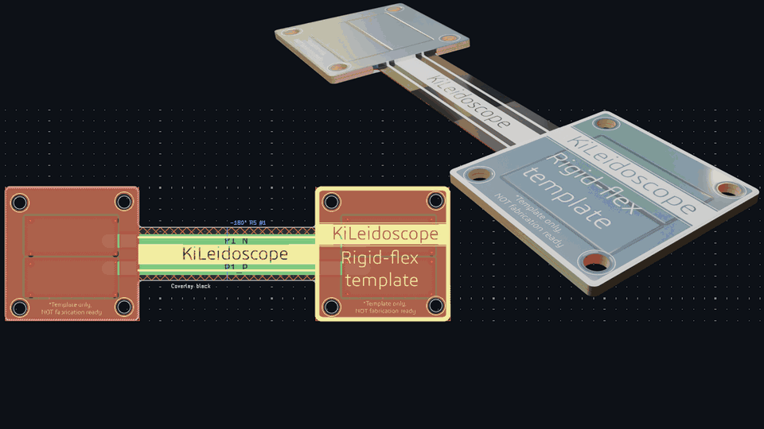

# (New!) Flex and rigid-flex boards (beta)
In this final addition, I targeted a niche but important specialization of printed boards: the flex and rigid-flex PCBs. To the best of my knowledge, these types of boards have not been supported by KiCad for 3D viewing. While some commercial software do have this capability, they come at a steep cost, learning curve, and lack the rendering tools that might get you a promotion after your next board meeting ;)

Flex circuits bend, twist and fold, something that is hard to picture from a flat layout. KiCad draws a flex board flat, and it has no setting for where it bends. KiLeidoscope's flex mode reads the marks you draw in KiCad for your fabricator (a line with "90° R2" on a layer named *Bend*, a rectangle with "steel 0.3 mm" on a layer named *Stiffener*) and folds the board in Blender: bends, twists, cones, wraps and domes, step by step, with the stiffeners, the coverlay and the parts on it. It also checks the flex as you route: bend radii, traces crossing a bend at an angle, vias and pads in bends, copper on layers the flex does not have, and more. And all this happens in real-time, maintaining full synchronization between KiCad and Blender!

The important bit is that KiCad stays the source of truth. The tool tries its best not to visualize anything that you have not designed. Everything a fab builds from (the stack-up, the bends, the stiffeners) comes from your KiCad design, live as you edit; Blender only shows it. It is therefore not only a great rendering tool, it can also be used to communicate your board goals with your fabricator, avoiding another round of manufacturing.

<picture>
  <source media="(prefers-color-scheme: dark)" srcset="../assets/FlexAnnotated_dark_web.png">
  
</picture>

The flex template folded in Blender. In KiCad it is a flat board with a few marks on its Bend and Stiffener layers.

## Contents

- [Starting from a template](#starting-from-a-template)
- [Setting up a board in KiCad](#setting-up-a-board-in-kicad)
- [The marks](#the-marks)
- [Using flex mode](#using-flex-mode)
- [Flex checks](#flex-checks)
- [What is drawn](#what-is-drawn)
- [How it works](#how-it-works)
- [Where each value comes from](#where-each-value-comes-from)
- [Known limitations](#known-limitations)
- [Disclaimer](#disclaimer)

## Starting from a template

The quickest start is one of the two KiCad templates in [`templates/`](../templates): a pure flex board and a rigid-flex board, each with the stack-up, the named layers, flex design rules, a few marks and a cheat sheet of every mark beside the board. [`templates/README.md`](../templates/README.md) says how to install them.

## Setting up a board in KiCad

1. **Stack-up.** In **Board Setup → Physical Stackup**, give the flex its polyimide: a dielectric (core or prepreg) whose **Material** is *Polyimide*. The copper layers either side of the polyimide, and everything between them, are the flex.
   - **Pure flex**: every copper layer sits on polyimide, for example F.Cu, a 50 µm polyimide core and B.Cu. The whole board is flex.
   - **Rigid-flex**: FR4 outside, polyimide inside. Only the inner copper layers continue into the flex. In the rigid-flex template that is In1.Cu and In2.Cu.
2. **Layers.** In **Board Setup → Board Editor Layers**, name three user layers **Flex**, **Bend** and **Stiffener**. Which user layers does not matter, flex mode finds them by name. You only need the ones you use.
3. **Flex zones** (rigid-flex only). Draw a closed shape on the **Flex** layer over each part of the board that is flex. A pure flex board needs none.
4. **Coverlay.** Optionally, put a text on the **Flex** layer saying `Coverlay black`, `Coverlay white` or `Coverlay amber` (the default). Coverlay openings are drawn on F.Mask and B.Mask, as solder mask openings are.
5. **Marks.** Draw the bends, twists and stiffeners as below.

A closed shape is a rectangle, a polygon or a circle, or lines and arcs whose ends meet. KiCad's fillet tool turns a rectangle into such pieces, which is fine.

## The marks

Every mark is a drawing on the **Bend** or **Stiffener** layer with a text beside it. The texts are read forgivingly, and what a text leaves out is filled in with a default; the panel then says what it assumed. Each mark in the panel has a button that copies its full text, to paste back into KiCad.

### Bends

A straight line on the **Bend** layer, across the flex from edge to edge, with a text beside it:

| Text | Meaning |
| --- | --- |
| `90° R2` | Fold by 90° with an inside radius of 2 mm. A positive angle folds the far side towards the top (F.Cu), a negative one towards the bottom. |
| `90° R2 #2` | The same, in step 2 of the folding sequence. Bends with the same step fold together. |
| `90°` | No radius: the smallest radius the flex takes when bent once (see [Bend radius](#bend-radius)). |
| no text | 90° at that radius. |

`R2 90`, `-90 deg r2mm` and `angle 45 radius 3` read just as well.

The side that folds is the side away from the largest part of the board. The bend curves over a strip as wide as its arc, (R + half the flex) × angle, centred on the line.

**A bend drawn as its area.** Instead of a line, draw a closed shape whose two sides across the flex are where the bend starts and stops curving. Its text gives only the angle (`90°`, `#2`); the radius follows from the width. When the two sides converge, the bend is a **cone**: it rolls the flex onto a cone whose tip is where the sides would meet, the radius growing away from the tip.

### Twists

A straight line on the **Bend** layer *along* a tail, with a text saying `twist` (`twist 90°`, `twist -45 #2`; without a number 90°). The tail turns about that line, evenly along its length, and what lies past its far end turns with it. Seen from the fixed side, looking along the tail, a positive angle turns it clockwise. The line may end on the board's edge.

**A bend and a twist together.** Where a bend's curve and a twist share a stretch of tail, the tail bends and twists at once there, as a ribbon winds round a pole. This works when the bend crosses the tail square to the twist's line and one hangs off the other, as in the flex template. Any other overlap, such as two bends whose curves share board, is listed as a problem: move them apart, or give the bend a smaller radius.

### Wraps

A wedge on the **Bend** layer (a ring sector, its tip where the cone's tip goes), with a text saying `wrap` (`wrap 360°`, `wrap -360°`; without a number 360°). The part of the board it lies on closes into a cone, or a piece of a cylinder, whose two ends meet where the wedge's sides are. A positive angle wraps towards the top, so F.Cu ends up inside; a negative angle puts F.Cu outside. Board past the second side runs on round, under the start. What hangs off the wrapped part by other bends follows the cone where it joins.

### Domes

A line, mostly an arc, on the **Bend** layer across a row of fingers, with a text saying `dome` and a radius or an angle (`dome R25`, `dome 30°`, `#2`). Every finger it crosses curls from the line to its tip, square to its length: at that radius, or by that angle at its tip. A dome curls the same way as a wrap it hangs off (inwards), else towards the top; a negative value curls it the other way. All its fingers fold as one, with one handle.

### Stiffeners

A closed shape on the **Stiffener** layer with a text inside or beside it: material, thickness and side, in any order.

| Text | Drawn as |
| --- | --- |
| `Polyimide 0.2 mm bottom` (also *Kapton*) | Polyimide, amber like the flex |
| `FR4 0.3 mm top` (also *FR-4*, *glass*, *epoxy*) | Board laminate |
| `steel 0.3 mm` (also *stainless*, *SUS*, *aluminium*, *metal*) | Metal |

Without a text a stiffener is `FR4 0.2 mm bottom`. A material KiLeidoscope does not know keeps its name and is drawn as FR4; the panel says so. A thickness reads as `0.2 mm`, `200 µm`, `200 um`, or a bare number of 5 or less (mm).

A stiffener has holes where the board has them: drilled pads, vias that reach its side, and cutouts in the board outline all go through it. A closed shape drawn inside a stiffener, on the Stiffener layer, is an opening in it.

### Coverlay

The coverlay's colour comes from a text on the **Flex** layer: `Coverlay amber` (clear polyimide film, the default), `Coverlay black` or `Coverlay white`. The panel's coverlay row has a menu that copies each text.

## Using flex mode

Flex mode lives in its own column beside the **KiLeidoscope** tab of the 3D View sidebar (**N**). Two bookmark tabs hang off the sidebar's left edge, **IMS** and **Flex**; a click on **Flex** opens its column to the left of the panel, and a click on the open tab closes it again. The tab is greyed for a board without flex: KiCad marks flex with polyimide in the stack-up, or with Flex, Bend and Stiffener user layers. Tick **Enable** to fold the board, see its stiffeners and coverlay, and run the flex checks; a lit stripe on the tab shows the mode is on once the column is closed. Flex and [IMS](ims.md) cannot be on together: switching one on turns the other off, and the column says so.

| In the Flex column | What it is |
| --- | --- |
| **Enable** | Flex mode on or off. Off, the board is drawn flat as any other board. |
| **Static** / **Dynamic** | How the flex is used: bent once at assembly, or flexing again and again in use. Dynamic flex needs far larger radii; the radius checks follow this choice. |
| **Flex layers**, **Flex + coverlay** | The copper layers in the flex and its thickness, coverlay included. |
| **Coverlay** | Its colour, from KiCad, with a menu copying the texts. |
| **Bend 1**, **Twist 2**, ... | Each mark with its angle and radius, the radius over the flex's thickness (✓ or ⚠ against what the flex needs), and a button copying its text. |
| **Stiffener 1**, ... | Each stiffener as its text says, with a copy button. |
| **Fold** | Folds the board: 0 flat, 1 every bend at its angle from KiCad. With steps, they fold one after another, each over an equal share of the slider. |
| **Step 1: Bend 1**, ... | The folding sequence. A click folds to the end of that step. |
| **Frames**, **fps**, **Key fold animation** | Keys the fold on the timeline for rendering (see below). |
| **Flex checks** | What the checks found, grouped by kind. With KiCad connected, a click on a check selects its items in KiCad. |

  

The rigid-flex template: KiCad on the left, the board folding in Blender on the right, then in X-ray mode with two nets highlighted.

**Handles.** Each bend also has a handle in the viewport: a circle round its line, `KLS bend 1` and so on, in the scene collection *KiLeidoscope bends*. Select one and turn it about its own Z axis (**R**, **Z**, **Z**) to fold that bend alone. The slider, the steps and the handles only change the view: the angles you design with stay in KiCad's texts.

**Animation.** **Key fold animation** keys the fold on the timeline: flat at frame 1, folded at the last frame (72 frames at 24 fps by default), the steps one after another. Every handle and every part is keyed per frame, so a render moves nothing by itself; render with **Render → Render Animation**, with your own camera, lights and settings. While the fold is keyed, the Fold slider and the steps move along the timeline. After an edit in KiCad, click **Re-key fold animation**; the **✕** beside it removes the keys and brings back live folding.

The folded board works with the rest of KiLeidoscope: X-ray mode, the colour modes, net highlighting, clicking items to select them in KiCad, and the [cut plane](cut-plane.md), whose section follows the thin flex.

## Flex checks

The checks run in the bridge, from KiCad's data, and follow your edits while the board is live. Read these checks carefully, as they hold important information about the manufacturability of your boards (is a flex PCB still a 'board' ? ;) )

| Check | Meaning |
| --- | --- |
| *GND crosses bend 1 at 25° off square; cross it square* | A trace crosses a bend more than 10° off square. Traces should cross bends at right angles. |
| *Via on bend 1*, *Pad 3 on bend 1*, *U2 is on bend 1* | A via, pad or part in a bend's curve or within 0.5 mm of it. |
| *SIG runs on F.Cu into the flex; F.Cu does not continue there* | Copper on a layer the flex does not have (rigid-flex). Also vias, pads and pours that reach into the flex on such layers. |
| *Bend 1: R0.5 mm is 2.7× the flex's 186 µm; static flex needs 10× (1.90 mm)* | The bend radius against the flex's thickness, for static or dynamic use (see [Bend radius](#bend-radius)). |
| *Dynamic flex should have 1 or 2 copper layers; this one has 4* | Flex that keeps flexing in use is built with one or two copper layers. |
| *Sharp inside corner at the flex; give it a radius so it cannot tear* | An inside corner of the outline at the flex turns more than 30° at once. |
| *SIG1 (In2.Cu) runs under SIG2 (In1.Cu) through the flex; stagger them* | Traces right on top of each other through the flex make it stiff and stress the copper. |
| *Solid GND pour on In2.Cu across bend 1; hatch it in the flex* | A solid pour across a bend: hatched copper bends far better. |
| *A stiffener reaches into bend 1* | A stiffener in a bend's curve, or within 0.5 mm of it. |
| *Bend 1 and bend 2 share board: ...* | Two curves overlap where flex mode cannot fold them together. |
| *Folded: the part past bend 1 runs into the board* | Folded to the end of the sequence (or of a step: *Step 2: ...*), the board runs into itself. |

The same list shows what flex mode could not read or had to assume: a bend line that does not cross the flex, two bends that cross, a stiffener drawn as an open line, an angle or radius left out of a text, and so on.

### Bend radius

The smallest inside radius a flex takes, over its thickness with the coverlay, after IPC-2223's usual figures:

| Copper layers in the flex | Static (bent once) | Dynamic (flexing in use) |
| --- | --- | --- |
| 1 | 6× | 100× |
| 2 | 10× | 150× |
| 3 or more | 20× | not recommended |

A bend without a radius in its text is drawn at the static figure, rounded up to 0.1 mm. For the templates' 2-layer flex (186 µm with coverlay) that is 1.9 mm.

## What is drawn

- **The flex** is drawn thin, at the thickness of its own copper layers and polyimide, with a short slope where it leaves rigid board. It is drawn that way flat too, so the flex always looks like flex.
- **Polyimide and coverlay**: the flex's body in amber polyimide, its outer faces in the coverlay's colour where the mask would be. Copper under amber coverlay shows as copper; under black or white coverlay it takes the film's colour, as copper under solder mask does. Coverlay openings keep the board's finish.
- **Folding**: the board is shown through folded copies of its objects, cut along every bend, and bent in Geometry Nodes, so the handles fold it smoothly. Parts sit where the board under them goes, also in a bend's curve.
- **Stiffeners**: solids of their thickness against the flex's top or bottom, with their holes, in polyimide, laminate or metal.
- **Hatched fills**: KiCad shapes filled with a hatch or cross-hatch are drawn with KiCad's own hatch.

## How it works

<picture>
  <source media="(prefers-color-scheme: dark)" srcset="../assets/flex-structure-dark.svg">
  
</picture>

The bridge reads the marks as drawings and texts on the user layers it finds by name, and never writes to KiCad. Everything it works out, the zones, bends, stiffeners and the checks, goes to Blender in one flex frame with every snapshot and after each edit. The add-on never bends the board objects KiCad sends: it makes folded copies of them, cut along every bend, and bends those in Geometry Nodes driven by the handles, so a fold is live and the originals stay as they are. Clicks and the cut plane are mapped back to the flat board through the copies.

## Where each value comes from

| Shown | Source |
| --- | --- |
| Flex layers and thickness | KiCad's stack-up: the copper either side of the polyimide dielectrics, from the board file (KiCad's live API has no materials). |
| Coverlay thickness | A fixed 50 µm per side (25 µm film, 25 µm adhesive). |
| Coverlay colour | A text on the Flex layer. |
| Bends, twists, cones, wraps, domes, steps | Lines, shapes and texts on the Bend layer. |
| Stiffeners | Shapes and texts on the Stiffener layer; their holes from the board. |
| Flex zones | Closed shapes on the Flex layer; for pure flex, the whole board. |
| Copper, vias, pads, parts | KiCad, live. |
| Fold angles while viewing | The Fold slider, the steps and the handles. KiCad's texts stay as they are. |

## Known limitations

**Beta.** Flex mode is new. Expect rough edges, and please report what you find.

**What is folded**

- Overlapping curves fold together only as a bend and a twist across the same tail. Other overlaps are listed, and each strip then folds on its own.
- A twisted tail's edges stretch a little, as real flex does when twisted; keep twisted tails narrow and long.
- The collision check folds the board itself, without its parts, and looks only at the end of each step, not along the way.
- The wrap's radius at its narrow end, in the panel, is taken from the board edge nearest the tip.
- Semi-flex boards (FR4 milled thin to bend) are not supported.
- Flex mode and IMS mode cannot be on at the same time.

**What is drawn**

- The coverlay is 50 µm per side, whatever the stack-up's solder mask thickness says.
- Hatched fills need KiCad's own Python (with *pcbnew*), which KiCad's installers include. Without it, a hatched shape is drawn as its outline. KiCad 10.0.0 to 10.0.5 also leave hatched fills out of `kicad-cli` plots, Gerbers included ([KiCad issue #25177](https://gitlab.com/kicad/code/kicad/-/issues/25177)); KiCad 10.0.6 fixes it.

## Disclaimer

Flex mode is an illustration built from your design data and the assumptions above. It is not a fabrication drawing, nor a mechanical simulation of your flex.

- **It is not a manufacturability check.** The checks follow common rules of thumb. Bend radii, stiffeners, coverlay and the stack-up are for you and your fab to confirm. Put them in your fab notes: the marks on the Bend and Stiffener layers are not a fab specification by themselves.
- **The fold is geometric.** The flex is folded as drawn, without its stiffness, springback or strain.

The [disclaimer](../README.md#disclaimer) and [license](../LICENSE) of KiLeidoscope apply in full: the software comes without any warranty, and you use it at your own risk.
