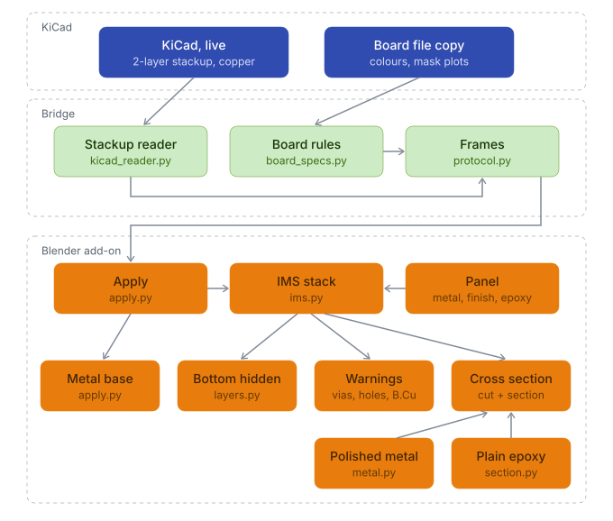

# (New!) Insulated Metal Substrate (IMS) boards

IMS boards are the aluminum or copper core boards used typically under LEDs and other high-power parts due to their excellent thermal conductivity. Its substrate consists of a copper layer forming the circuit, above a thin, heat-conducting epoxy and below that the thick metal base that spreads the heat into a heatsink. KiCad (and many other ECAD tools) unfortunately have no dedicated IMS setting, and such boards are represented as simple 2-layer laminate boards. KiLeidoscope's IMS mode shows it as the board you will get: the metal base in B.Cu's place, the thin epoxy above it, and F.Cu on top, in 3D and in the cut plane's cross-section. All within reach of Blender's great arsenal of rendering and analysis tools!

<picture>
  <source media="(prefers-color-scheme: dark)" srcset="../assets/IMS_dark_web.png">
  
</picture>

An LED board on a copper base in Realistic mode. In KiCad it is a plain 2-layer board; KiLeidoscope draws its metal base.

## Contents

- [Setting up the board in KiCad](#setting-up-the-board-in-kicad)
- [Using IMS mode](#using-ims-mode)
- [What is drawn](#what-is-drawn)
- [Warnings](#warnings)
- [Exported boards](#exported-boards)
- [How it works](#how-it-works)
- [Where each value comes from](#where-each-value-comes-from)
- [Known limitations](#known-limitations)
- [Disclaimer](#disclaimer)

## Setting up the board in KiCad

Design the board the way it is ordered. A fab sells an IMS board by its metal and its total thickness ("aluminum, 1.6 mm") and supplies its own thin dielectric (typically an epoxy), so nothing about the metal or the epoxy needs to be modelled in KiCad.

1. In **Board Setup → Physical Stackup**, use **2** copper layers.
2. Set the dielectric so the board's total thickness is the thickness you will order. Its material and εr do not matter to KiLeidoscope.
3. Route on **F.Cu** only. Leave **B.Cu** empty, or fill it with one pour over the whole board if you like to see the base in KiCad.
4. Avoid vias and plated holes. Unplated mounting holes are fine.

## Using IMS mode

IMS mode lives in its own column beside the **KiLeidoscope** tab of the 3D View sidebar (**N**). Two bookmark tabs hang off the sidebar's left edge, **IMS** and **Flex**; a click on **IMS** opens its column to the left of the panel, and a click on the open tab closes it again. A lit stripe on the tab shows the mode is on once the column is closed. IMS and [flex mode](flex.md) cannot be on together: switching one on turns the other off, and the column says so.

1. Tick **Enable**. The board is sent again and rebuilt with the base, which takes a brief moment.
2. Pick **Aluminum** or **Copper**, and a **Finish**.
3. Set the **Epoxy** to your fab's dielectric thickness, if you know it.

The box below then shows the base's thickness, F.Cu's copper and the board's total, which remains synchronized to the value set in KiCad.

IMS mode needs a 2-layer board; on any other board the tab and the switch are greyed out.

| Control | What it does |
| --- | --- |
| **Enable** | Draws the board on a metal base. Off: the board is KiCad's 2-layer board again. |
| **Aluminum** / **Copper** | The base's metal, in 3D and in the cross-section. Aluminum is the usual choice; copper bases spread heat better. |
| **Finish** | The base's outer faces in Realistic colours: **Mill finish** (as rolled, the usual base), **Brushed**, **Polished** or **Nickel plated**. The cross-section always shows a polished cut. |
| **Epoxy (µm)** | The thermal dielectric under F.Cu, from 75 to 150 µm. Default 100 µm. |

Turning IMS mode on or off and changing the epoxy rebuild the board, from KiCad or from the dump file. The metal and the finish only recolour it.

## What is drawn

- **Metal base**: from the bottom of the board up to the epoxy, in the chosen metal and finish. It takes B.Cu's place, B.Cu's own thickness included.
- **Epoxy**: a plain homogeneous layer under F.Cu. It is also what a see-through solder mask shows (**Solder mask opacity** below 1).
- **F.Cu, mask, silkscreen and components**: as KiCad has them, at the same heights as without IMS mode.
- **Bottom layers**: B.Cu, B.Mask, B.SilkS, bottom-side components, bottom paste and B.Fab are hidden. The base sits where they would be.
- **Holes**: unplated holes run through the base, their walls bare metal. Vias and plated holes are drawn as KiCad has them, through the base, and the panel warns about them.
- **Cross-section**: the base as polished metal (lit as metal in Realistic mode) and the epoxy as a plain cream band. Via barrels run down through the base, but B.Cu's via lands are not drawn there.

## Warnings

As IMS boards have only a single copper layer, anything that goes through the epoxy reaches the base. Therefore, as a safeguard, the IMS box lists:

| Warning | Meaning |
| --- | --- |
| *N vias would short to the metal base* | Every via's plated barrel would touch the base. |
| *N plated holes would short to the metal base* | Same story for plated pad holes (through-hole parts). |
| *B.Cu has copper of its own; the metal base takes its place* | B.Cu has tracks, pads or a partial pour. One pour over 90 % or more of the board counts as the base and is not warned about. |

The warnings follow edits in KiCad while the board is live.

## Exported boards

An exported IMS board keeps its base, metal, finish and stack. Imported view-only, it stays an IMS board next to any other board, whatever the live board's IMS setting. With that board picked in the **Boards** panel, a line under its thickness box reads, for example, *IMS: Aluminum base, 1.41 mm*.

## How it works

<picture>
  <source media="(prefers-color-scheme: dark)" srcset="../assets/ims-structure-dark.svg">
  
</picture>

The bridge does not change: it sends the 2-layer board as KiCad has it. When the board's heights arrive, the add-on works out the IMS stack (the epoxy under F.Cu, the base below it) before anything else is placed, so the copper, vias, drills, components and cross-section all use the same heights. The base is the board outline filled and extruded, sharing the outline's mesh, so cutouts and holes go through it too. Its curved walls are shaded smooth, as flat facets would show as stripes on a shiny metal.

## Where each value comes from

| Shown | Source |
| --- | --- |
| Board thickness, F.Cu copper thickness | KiCad's stack-up. Copper without a thickness is drawn flat. |
| Epoxy thickness | The panel's **Epoxy**, one value for the board. KiCad's dielectric is not used. |
| Base thickness | What is left: the board's thickness less F.Cu's copper and the epoxy. |
| Base metal and finish | The panel. KiCad stores neither. |
| Vias, holes, B.Cu copper | KiCad, live. |
| Colours | Display approximations: bare aluminum or copper, nickel, and a cream epoxy. |

## Known limitations

**The setting**

- IMS mode is one setting for the live board, not stored with the board. It stays on for the next 2-layer board you open, until you untick it.
- Only 2-layer boards. Multilayer and double-sided IMS builds are not drawn. On a board with more than 2 layers the switch is greyed out. 

**What is drawn**

- Vias and plated holes are drawn through the base, as stored in KiCad.
- The epoxy is a plain layer. A real thermal dielectric is a ceramic-filled resin; its filler is not shown.
- The base's edges are drawn as straight as the rest of the board. Routing, V-score and anodising details are not shown, although this could easily be added using Blender's mesh tools. 
- An unplated hole's wall is drawn as bare metal over its whole height, the epoxy's thin band included.

## Disclaimer

IMS mode is an illustration built from your design data and the assumptions above. It is not a fabrication drawing, nor is it an accurate CAD representation of your board. 

- **It is not a manufacturability check.** Which metals, thicknesses, epoxies and finishes your fab offers, and whether your board can be built that way, is for you and them to confirm. Put the IMS specification in your fab notes and order options. KiCad's 2-layer board does not convey it.
- **Do not take measurements from it.** The epoxy and the base are drawn from the panel's values, not your fab's.

The [disclaimer](../README.md#disclaimer) and [license](../LICENSE) of KiLeidoscope apply in full: the software comes without any warranty, and you use it at your own risk.
